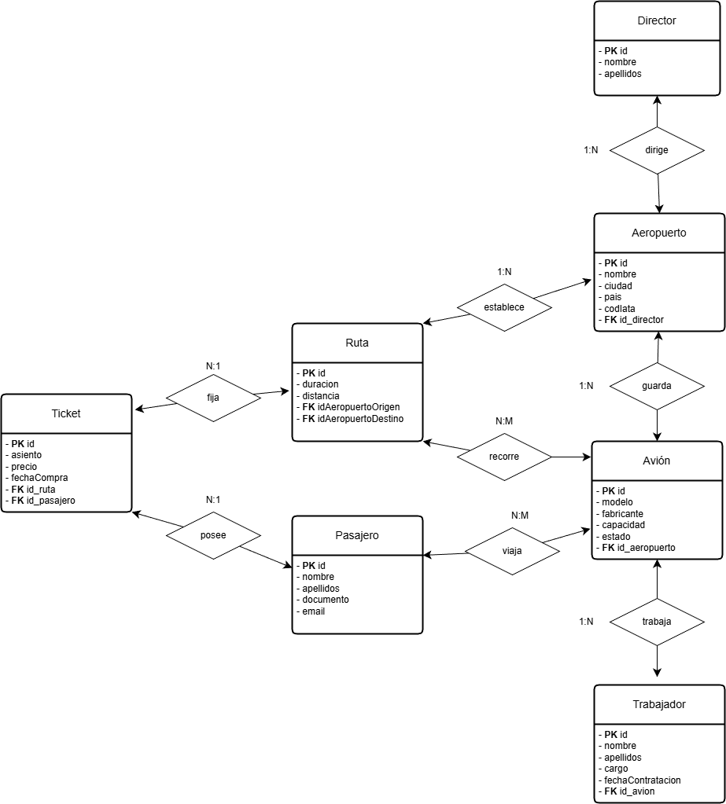

# Proyecto Aeropuerto

Sistema de gestión de un aeropuerto con interfaz web, construido con Java y Spring Boot. Permite administrar aeropuertos, aviones, rutas, pasajeros, tickets y trabajadores, con formularios y listados paginados, filtrado, ordenación e internacionalización.

## Tecnologías

- Java 21 (`pom.xml:30`)
- Spring Boot 3.5 (`pom.xml:6-9`)
- Spring MVC y Thymeleaf para la web (`pom.xml:41-48`, `src/main/resources/templates/`)
- Spring Data JPA y Hibernate (`pom.xml:33-40`, `application.properties:6-9`)
- Base de datos MariaDB (`pom.xml:50-54`), con scripts `schema.sql` y `data.sql`
- Jakarta Validation para validaciones de formulario (`pom.xml:65-70`)
- Lombok para reducir boilerplate (`pom.xml:56-59`)
- Dotenv para variables de entorno (`pom.xml:71-75`, `src/main/java/.../config/DotenvConfig.java:8-41`)
- Internacionalización (i18n) con `messages_*.properties` y cambio de idioma por `?lang=` (`src/main/java/.../config/LocaleConfig.java:26-60`, `src/main/resources/messages_*.properties`)

## Arquitectura

- Controladores MVC en `src/main/java/.../controllers/` gestionan rutas y vistas, p.ej. listado y CRUD de aeropuertos (`src/main/java/.../controllers/AeropuertoController.java:46-70`, `96-120`, `122-146`, `148-155`).
- Entidades JPA en `src/main/java/.../entities/` modelan el dominio (Aeropuerto, Avion, Ruta, Pasajero, Ticket, Trabajador, Director).
- Repositorios en `src/main/java/.../repositories/` encapsulan acceso a datos, p.ej. búsqueda y paginación (`src/main/java/.../repositories/AeropuertoRepository.java:8-19`).
- Vistas Thymeleaf en `src/main/resources/templates/pages/**` con fragmentos reutilizables (`templates/fragments/`).
- Configuración:
  - Carga de `.env` al inicio (`src/main/java/.../config/DotenvConfig.java:18-40`).
  - Internacionalización (`src/main/java/.../config/LocaleConfig.java:26-60`).
  - Servido de archivos estáticos desde `UPLOAD_PATH` como `/uploads/**` (`src/main/java/.../config/WebConfig.java:15-29`).

## Base de datos

- Motor: MariaDB. Puedes levantarlo con Docker Compose (`docker-compose.yml`).
- Esquema y datos iniciales se aplican automáticamente al arrancar (por `spring.sql.init.mode=always`, `application.properties:10`).
- Dialecto: MySQL8 (`application.properties:9`).

Variables de entorno esperadas (archivo `.env` en la raíz):

```
# Base de datos
DB_URL=jdbc:mariadb://localhost:3306/aeropuerto
DB_USER=aeropuerto_user
DB_PASSWORD=secret
DB_ROOT_PASSWORD=secret
DB_DATABASE=aeropuerto
DB_DRIVER=org.mariadb.jdbc.Driver

# Subida/servido de ficheros
UPLOAD_PATH=C:/ruta/absoluta/a/uploads
```

- El servidor sirve ficheros estáticos bajo `/uploads/**` desde la ruta indicada en `UPLOAD_PATH`.
- `application.properties` usa estas variables (`src/main/resources/application.properties:2-5`).

### Docker Compose

- Arranca MariaDB: `docker-compose up -d`
- Detén: `docker-compose down`

## Entidades

- Aeropuerto: nombre, ciudad, país, código IATA; relación con `Director` y `Avion` (`src/main/java/.../entities/Aeropuerto.java:21-47`, `49-63`).
- Avion: modelo, fabricante, capacidad, estado; pertenece a un `Aeropuerto`; relaciones con `Trabajador`, `Ruta` y `Pasajero` (`src/main/java/.../entities/Avion.java:19-39`, `69-97`).
- Director: nombre y apellidos; dirige varios aeropuertos (`src/main/java/.../entities/Director.java:21-34`, `37-40`).
- Ruta: origen y destino (dos aeropuertos), duración y distancia; relación muchos-a-muchos con aviones (`src/main/java/.../entities/Ruta.java:17-30`, `49-65`).
- Pasajero: datos personales; relación muchos-a-muchos con aviones (`src/main/java/.../entities/Pasajero.java:25-53`, `55-58`).
- Trabajador: datos personales, cargo y fecha de contratación; trabaja en un avión (`src/main/java/.../entities/Trabajador.java:23-50`, `53-59`).
- Ticket: asiento, precio, fecha de compra; vinculado a una `Ruta` y un `Pasajero` (`src/main/java/.../entities/Ticket.java:21-37`, `39-48`).

### Modelo Entidad-Relación

Para visualizar el modelo ER, coloca aquí la ruta de la imagen. Por defecto se incluye la imagen del proyecto:



## Internacionalización

- Idioma por defecto: español (`src/main/java/.../config/LocaleConfig.java:28-31`).
- Cambia el idioma con `?lang=en` o `?lang=es` en cualquier URL.
- Textos en `src/main/resources/messages.properties`, `messages_es.properties`, `messages_en.properties`.

## Interfaz y funcionalidades

- Listados con paginación, búsqueda y ordenación, por ejemplo aviones (`src/main/resources/templates/pages/avion/avion.html:33-101`).
- Formularios de alta y edición para todas las entidades (`templates/pages/**/**-form.html`).
- Mensajes de éxito/error con soporte i18n.

## Ejecución

En Windows:

```
# Arranca la base de datos (opcional si ya tienes MariaDB)
docker-compose up -d

# Ejecuta la aplicación
mvnw.cmd spring-boot:run
```

En sistemas Unix (Linux/macOS):

```
./mvnw spring-boot:run
```

La aplicación se expone en `http://localhost:8080/`. Página de inicio: `src/main/resources/templates/pages/index.html`.

## Estructura del proyecto

```
src/
  main/
    java/org/iesalixar/daw2/gonzalomariomontero/aeropuerto/
      config/        # Configuración (dotenv, i18n, estáticos)
      controllers/   # Controladores MVC
      entities/      # Entidades JPA
      repositories/  # Repositorios Spring Data JPA
      AeropuertoApplication.java
    resources/
      templates/     # Vistas Thymeleaf
      application.properties
      schema.sql     # Esquema
      data.sql       # Datos de ejemplo
      messages*.properties  # i18n
  test/java/.../AeropuertoApplicationTests.java
```

## Desarrollo

- Construir: `mvnw.cmd clean package`
- Pruebas: `mvnw.cmd test`
- Dependencias gestionadas por Maven (ver `pom.xml`).

## Notas

- El nombrado de columnas evita cambios automáticos de Hibernate (`application.properties:15-17`).
- La opción `spring.jpa.show-sql=true` ayuda a depurar consultas (`application.properties:7-8`).

